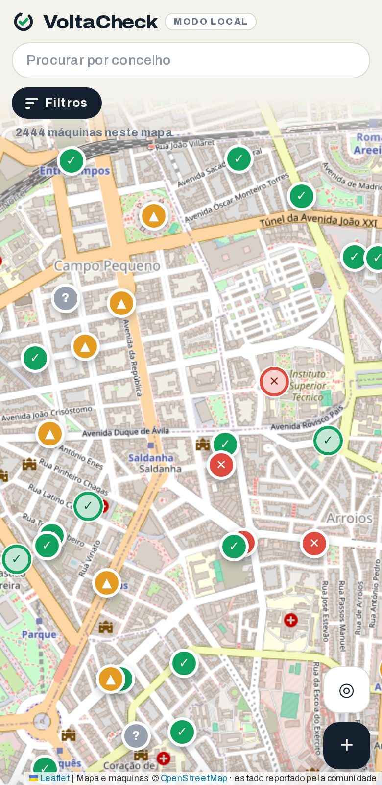
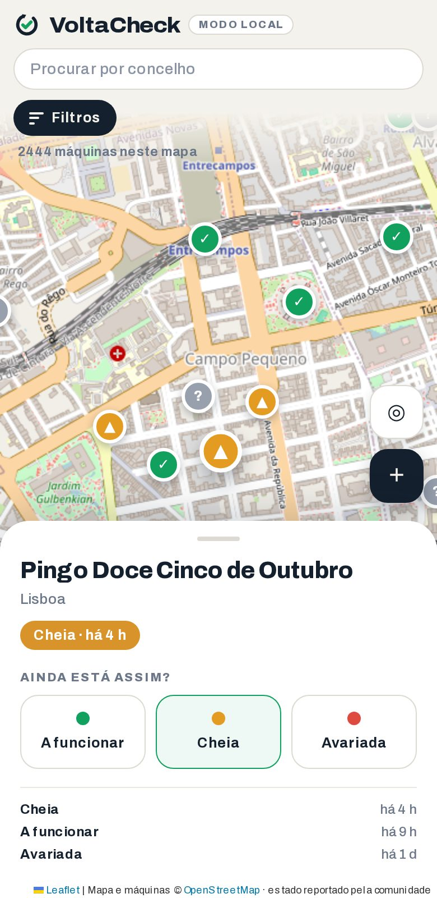
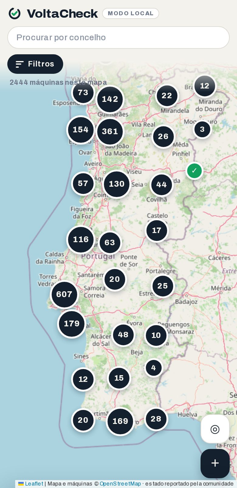
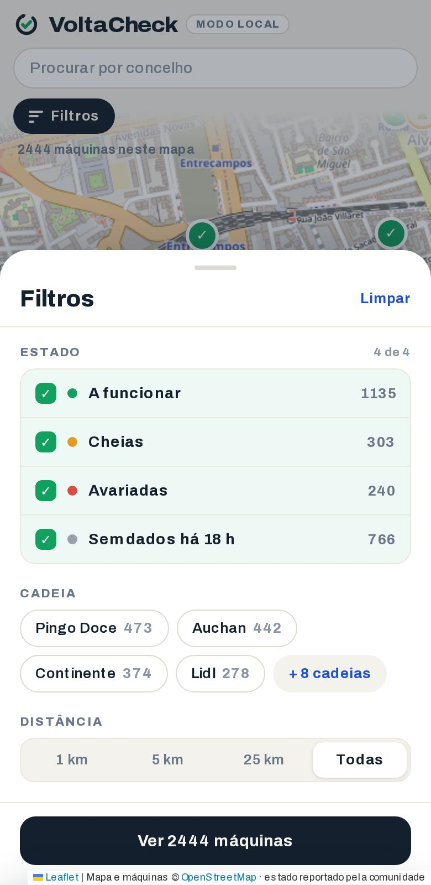
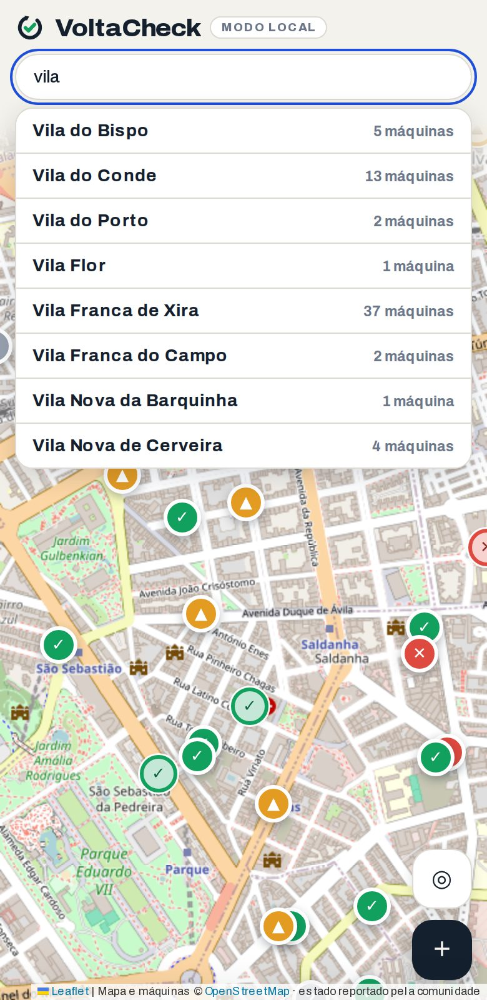
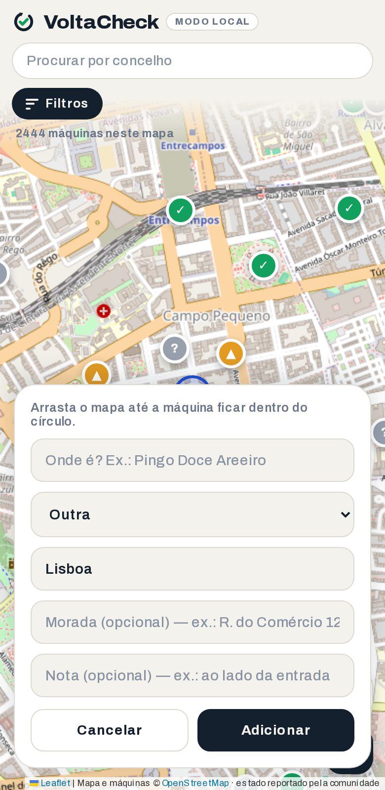

# VoltaCheck

A community map of the deposit-return machines in Portuguese supermarkets —
which ones are working, which are full, which are broken. 2 444 machines
across the mainland, Madeira and the Azores. Anyone can say what they just
saw, and every report visibly fades after 18 hours, so the map can't quietly
go stale.

**Live at [isabelhdias.github.io/voltacheck](https://isabelhdias.github.io/voltacheck/)**

> Not affiliated with SDR Portugal or **Volta**, the official deposit-return
> scheme. This is an independent community project, and nothing in it speaks
> for them.

## What it looks like

<table>
  <tr>
    <td width="50%"></td>
    <td width="50%"></td>
  </tr>
  <tr>
    <td><b>The map.</b> One pin per machine, coloured by its last report. Grey means nobody has said anything recently.</td>
    <td><b>A machine.</b> Its state, how old that is, the last few reports — and three buttons to say what you just saw.</td>
  </tr>
  <tr>
    <td></td>
    <td></td>
  </tr>
  <tr>
    <td><b>Zoomed out.</b> Machines group into counted bubbles, so the whole country fits without a wall of overlapping pins. A bubble is neutral on purpose — it holds machines in every state at once. Tap one to open it up; anywhere too sparse to crowd keeps its own pin.</td>
    <td><b>Filters.</b> By state, by supermarket, by distance from you. They compose, and the counts tell you what a tap would reveal before you make it.</td>
  </tr>
  <tr>
    <td></td>
    <td></td>
  </tr>
  <tr>
    <td><b>Search.</b> Type a concelho — accents optional — and the map frames its machines.</td>
    <td><b>Adding one.</b> Drag the map until the machine is in the circle and describe it. Submissions go to a review queue, not straight onto the map.</td>
  </tr>
</table>

<sub>Screenshots are the real app running in local mode against the seed data,
with a set of demo reports — the live map's colours depend on who reported
what today.</sub>

## The decay is the point

A machine's state is only worth something for as long as it is plausibly
still true, so the app puts a clock on every report:

| Age of the last report | What you see |
|---|---|
| under 3 h | the colour, solid, and *"Estiveste lá agora?"* |
| 3 h – 18 h | the colour, solid, and *"Ainda está assim?"* — an invitation to reconfirm |
| over 18 h | the same colour, **hollow** — pale fill, coloured ring — and *"sem dados recentes"* beside the timestamp |
| never reported | grey |

Under every one of those, the sheet says exactly when the last report was
filed: *"Último report: 20/08, 08:06"*.

An aged report used to drop to grey, which was harsher than the truth — the
app knew what the machine last was and threw it away. It now keeps the
colour and takes the weight out of it, so you can tell "full yesterday" from
"nobody has ever checked". What that fade must never do is pass for a fresh
report, so it changes the picture only: an aged machine is still counted and
filtered as *no recent data*, never as its old status, and the sheet offers
it no pre-ticked answer to agree with.

Nothing in the app is allowed to make an old report look fresh. Both
thresholds live in `app/config.js`; the logic is `app/domain.js` —
`statusOf()` for what a machine counts as, `paintOf()` for how it's drawn.

## How it's built

**There is no build step.** `index.html` is markup and CSS plus one
`<script type="module">`; the `app/` files are native ES modules the browser
loads directly. GitHub Pages serves the repo from `main` exactly as it is, so
what you read here is what runs. Leaflet and supabase-js come from a CDN —
that's the whole stack.

Reports and machines live in a Supabase Postgres database, reached over
PostgREST. Anonymous users have no INSERT anywhere: writes go through
Postgres functions that rate-limit by device and IP, check proximity for a
report, and hold new machines in a review queue until they're approved. Each
of those functions also counts what it decided, which is what the admin
dashboard at `/admin/` is read off — coverage, the report funnel, latency and
errors, on telemetry sized to fit Supabase's free tier. The panel is public
HTML behind a database-side gate rather than a hidden URL; see
[`docs/observability-plan.md`](docs/observability-plan.md).

Leave the two values in `app/config.js` empty and the app falls back to
**local mode** — the same seed data, reports kept in `localStorage`, no
network. That path is supported and tested, not a leftover.

**Diagrams of all of it: [`docs/diagrams.md`](docs/diagrams.md).**

## Running it

```sh
git clone https://github.com/isabelhdias/voltacheck.git
cd voltacheck
npx http-server -p 8099 -s .     # any static server; or: npm run serve
```

Then open <http://127.0.0.1:8099/>. `app/config.js` ships with the live
project's URL and anon key, so a local copy talks to the real database —
blank those two strings first if you'd rather poke at it offline.

## Tests

`package.json` exists for these alone; nothing here is ever served to a
browser.

| Command | What it covers | Needs |
|---|---|---|
| `npm run test:unit` | `app/domain.js` against `test/vectors/*.json` — decay, search, distance | nothing, ~100 ms |
| `npm run test:integration` | `app/api.js` and the SQL guards — reports, submissions, telemetry ingest — against a real Postgres + PostgREST | Docker |
| `npm run test:e2e` | the real `index.html` in Chromium, in local mode | `npx playwright install` |

CI runs all three on every push and pull request, and each open PR is also
published at `/preview/pr-N/` with the database keys blanked.

## Where things are

| | |
|---|---|
| `index.html` | markup + styles, one script tag |
| `app/` | the modules: `domain` (pure logic), `store`, `api`, `map`, `ui`, `telemetry`, `config`, `main` |
| `admin/` | the private dashboard at `/admin/` — coverage, activity, the report funnel, errors and traces. English; gated by `public.is_admin()` in Postgres, not by the page |
| `seed/` | 2 444 machines, generated — as JS for the browser, CSV and SQL for Supabase |
| `schema.sql` | tables, RLS, and the three functions that are the only way to write — reports, machine submissions, and telemetry |
| `tools/` | the OpenStreetMap importer, the review-queue renderer, the screenshot script |
| `test/` | vectors, unit, integration, e2e |
| `docs/` | [architecture](docs/architecture.md) · [diagrams](docs/diagrams.md) · [domain contract](docs/domain-contract.md) · [rate limiting](docs/rate-limiting-plan.md) · [observability](docs/observability-plan.md) · [seed data](docs/seed-data-plan.md) · [Supabase setup](docs/supabase-setup.md) · [redesign](docs/redesign.md) · [branch protection](docs/branch-protection.md) |

Changing any of it? `CLAUDE.md` lists which of these docs — and which
diagram — each kind of change has to update, in the same commit.

## Data

Machine locations come from **[OpenStreetMap](https://www.openstreetmap.org/copyright)**
contributors, under the ODbL, imported by `tools/import_osm.py`. Map tiles are
OpenStreetMap's too. Everything else — the reports — is what people using the
app said they saw.
