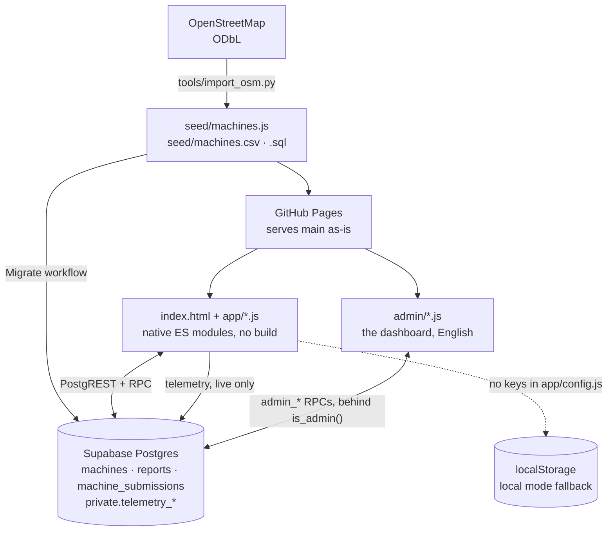
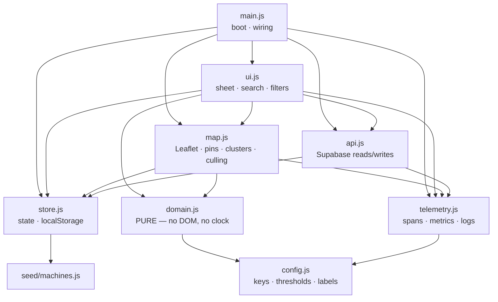
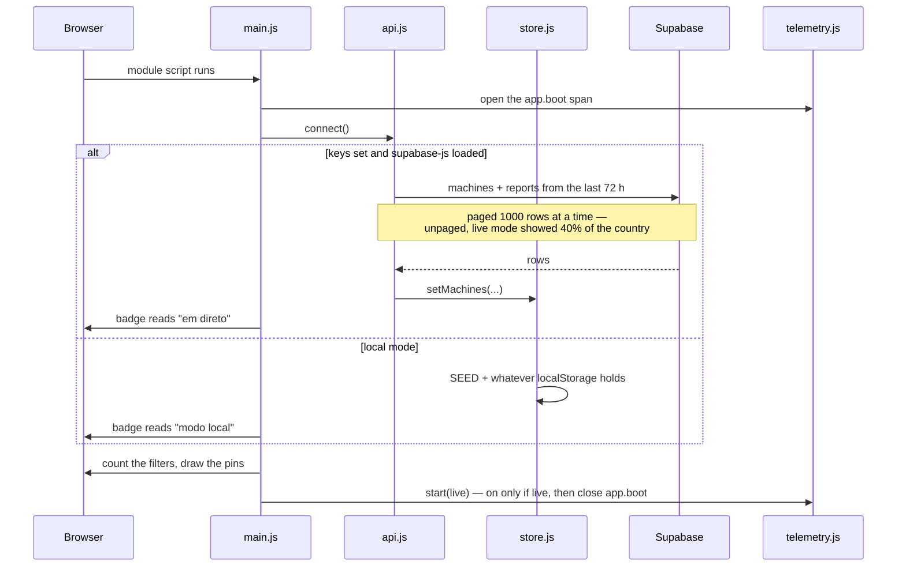
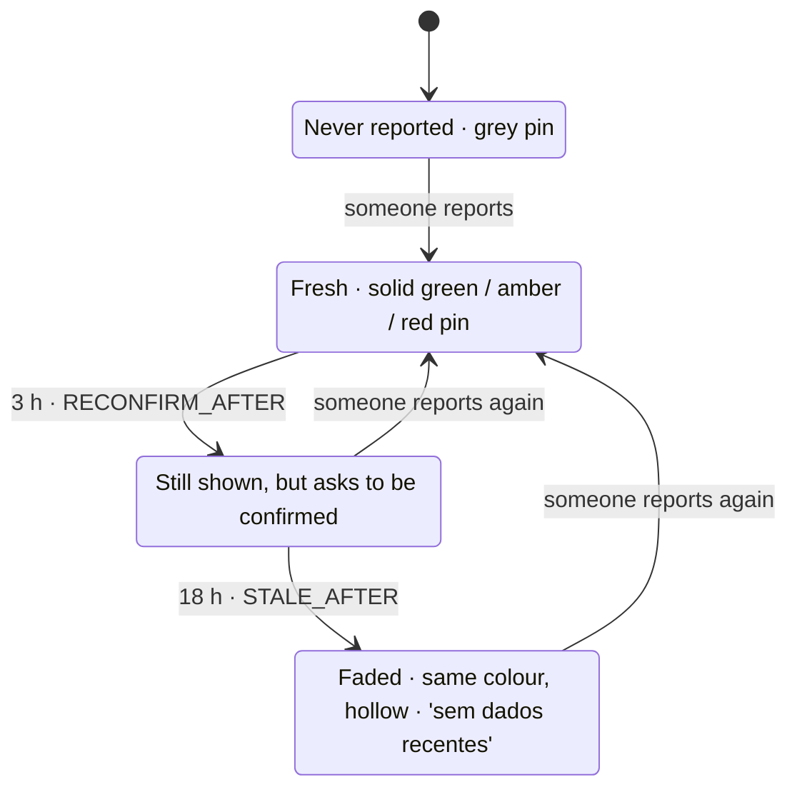
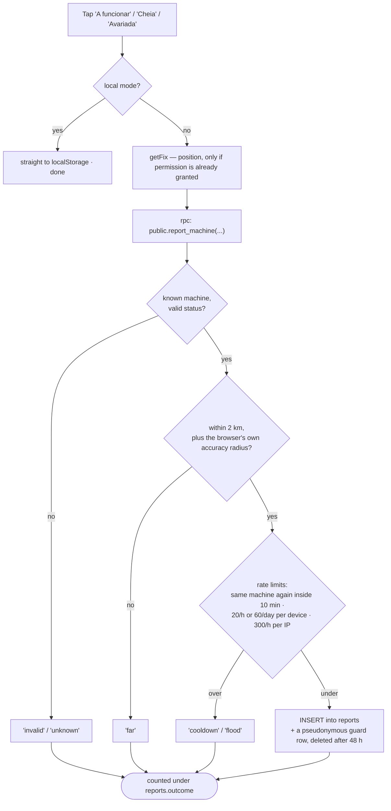
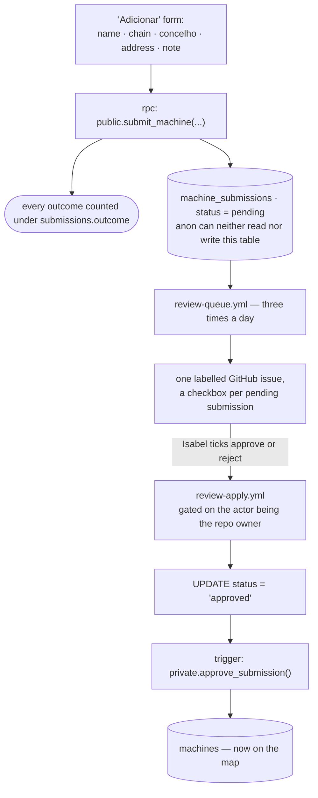
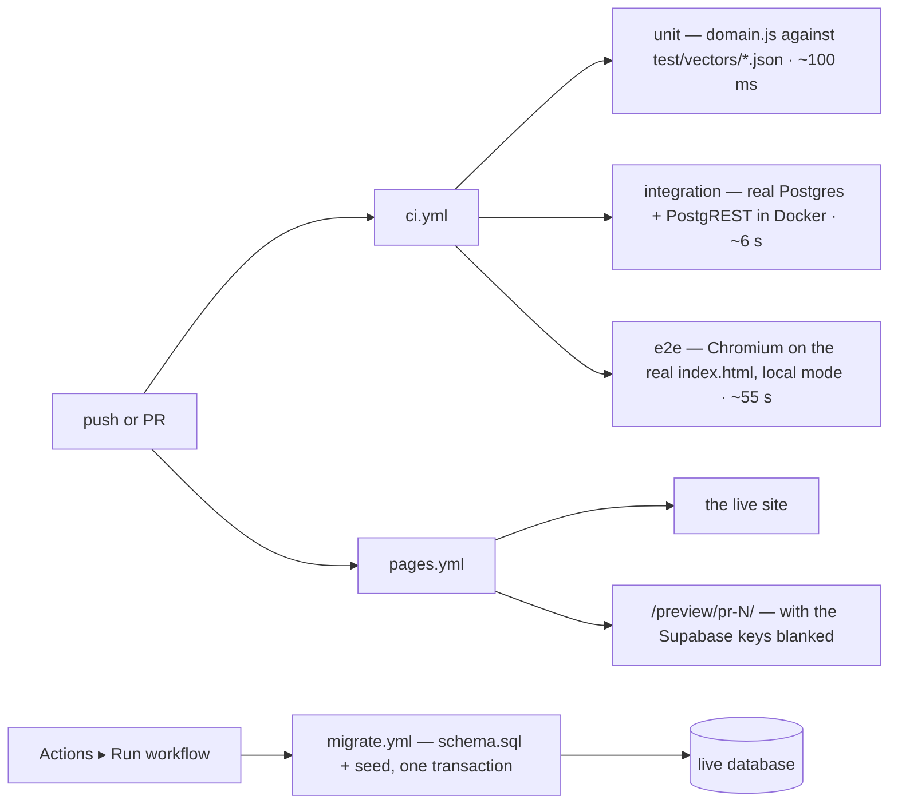
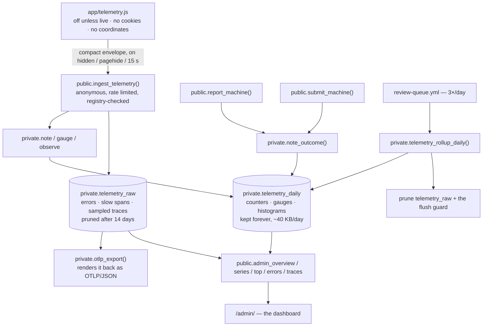
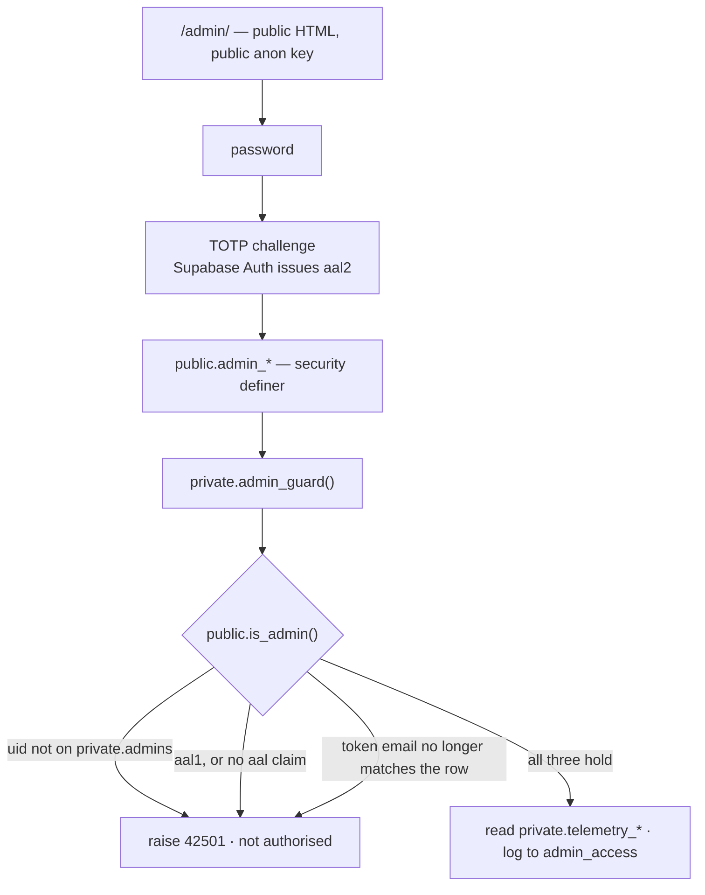

# Diagrams

The same system `docs/architecture.md` describes in prose, drawn. Read that
one for the *why*; this one is for getting the shape of it in your head
quickly. Every diagram is Mermaid, so it renders inline on GitHub — including
the mobile app, which is where this repo is mostly read.

> **Keeping these true is part of changing the code, not a follow-up.**
> "Keeping the docs true" in `CLAUDE.md` says which diagram each kind of
> change has to update, and it refers to them by the numbers below — so add
> new diagrams at the end rather than renumbering the existing ones.

## 1. The whole thing, once

Two things worth noticing. The seed data goes to *both* sides — the same
import feeds the file the browser reads in local mode and the SQL the live
database is loaded from. And the dotted line is a real, supported path: blank
the two config values and the whole app still works, offline, on one device.

## 2. The modules

Every module reads `config.js`; only `domain.js`'s and `telemetry.js`'s
arrows are drawn, because those are the ones that matter — the two decay
thresholds, and whether telemetry is on at all. `domain.js` is the bottom of
the graph on purpose: it depends on nothing else, so it can be lifted out and
re-implemented in Swift or Kotlin without dragging the browser along. See
`docs/domain-contract.md`.

`telemetry.js` is the one module everything may call and nothing may depend
on: it imports only `config.js`, exports no state anyone reads, and swallows
its own errors. A module that four others call has to be unable to break any
of them.

## 3. What happens when the page loads

`start()` is what decides whether a single byte is ever sent, and it runs
*after* the live-or-local branch above. Local mode and PR previews take the
same path and send nothing, which is what keeps the dashboard's numbers the
live site's.

## 4. The decay clock

This is the product, not a detail. A report is only worth something for as
long as it is plausibly still true.

Under 3 h the sheet asks **"Estiveste lá agora?"**. Past 3 h it switches to
**"Ainda está assim?"** — same question, but it now reads as an invitation to
reconfirm. Past 18 h there is nothing left to confirm: the pin keeps its
colour but turns hollow, the sheet spells out *sem dados recentes*, and the
prompt goes back to **"Estiveste lá agora?"** with no answer pre-ticked.
Both thresholds live in `app/config.js`.

Grey is now only the left-hand state — a machine nobody has ever reported.
The faded state is a *drawing*, not a status: `statusOf()` still calls it
`"stale"`, so the filters and the counts treat "full yesterday" as no recent
data rather than as full. Only `paintOf()` keeps the hue. Every machine also
carries the timestamp of its last report in the sheet, in all three states
that have one.

## 5. What a report goes through

Anonymous users have no INSERT anywhere. The only door is one Postgres
function, and it returns a string per outcome so the app can say something
specific in Portuguese instead of surfacing an HTTP code.

No coordinates at all is accepted: blocking a real report is worse than
letting an unverifiable one through, and someone willing to lie picks their
coordinates too. `docs/rate-limiting-plan.md` has the full reasoning.

Every one of those six outcomes is counted, which it did not used to be:
until the dashboard existed, a report rejected as `far` left no trace
anywhere, so a proximity rule that was turning away real people would have
looked exactly like a quiet week. See diagram 8.

## 6. What a *new machine* goes through

Anyone can suggest a machine from their sofa — no proximity check, because
people map from home. Nothing they submit reaches the map until it is
approved, and approving is a checkbox in a GitHub issue, not a trip to the
Supabase dashboard.

The scheduled half is the one piece that can fail quietly: GitHub disables
scheduled workflows after 60 days without a commit. `docs/supabase-setup.md`
explains how that shows up.

## 7. What runs in CI, and what ships

CI is the only feedback loop this project has: Isabel works from a phone and
cannot run anything locally, so a red check is the review.

## 8. Where the dashboard's numbers come from

Two tiers, because one would not fit the free tier. Aggregates are upserted
in place and kept forever — they do not grow with traffic. Individual
records are kept only for what has to be an individual, and only for a
fortnight.

`ingest_telemetry()` is guarded exactly like the two write functions above
it: same salt, same hashing, same string returns. It adds a metric registry,
which is the part that stops a caller inventing names and dimension values
until the forever-table is the size of the free tier.
`docs/observability-plan.md` has the arithmetic.

## 9. Who gets to read the dashboard

The panel at `/admin/` is public HTML on GitHub Pages, served from a public
repo, using the public anon key. That is fine, and it is fine for exactly one
reason: **the page is not the gate.** Every read goes through a
`security definer` function that asks Postgres first, and the tables it reads
live in `private`, which the Data API does not expose at all.

Three things carry the weight, in this order: **sign-ups are off** in Supabase
Auth, so no account can be created to be refused with; the allowlist is keyed
on the **uid**, because Supabase lets a user change their own email; and
`aal2` is required **in the database**, so a password alone is never enough.
`require_aal2` is a column rather than a constant, so it can be relaxed with
an `update` if enrolling TOTP on a phone turns out to be miserable — it
defaults to on, and `test/integration/admin.test.js` proves it is consulted.
