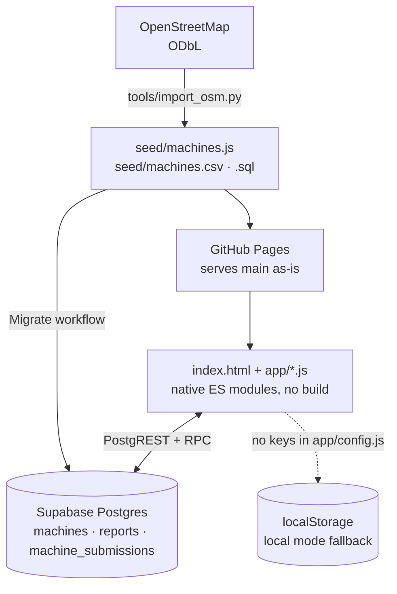
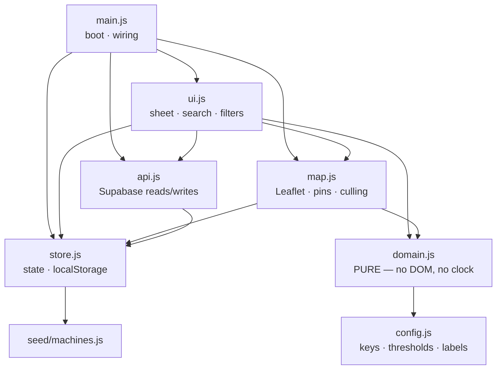
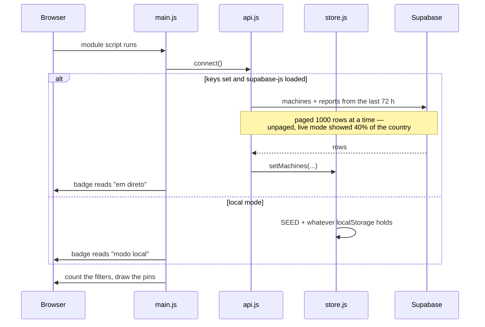
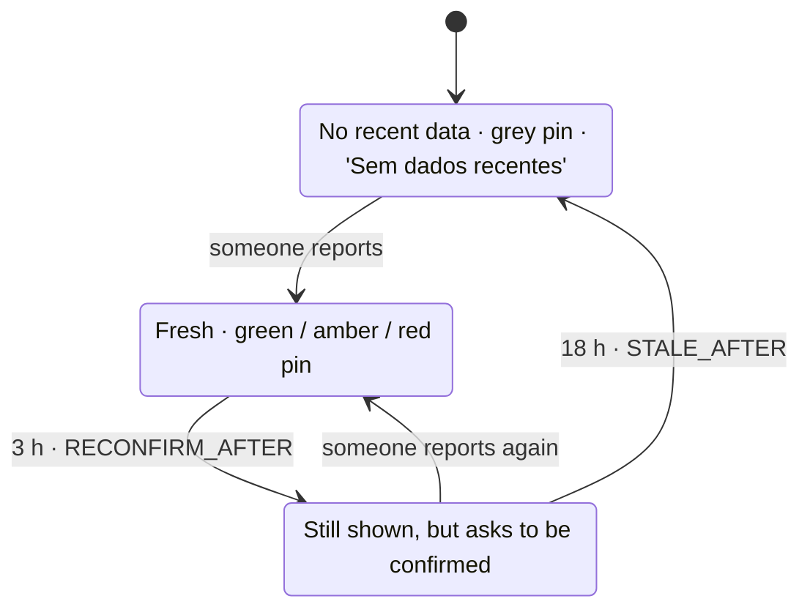
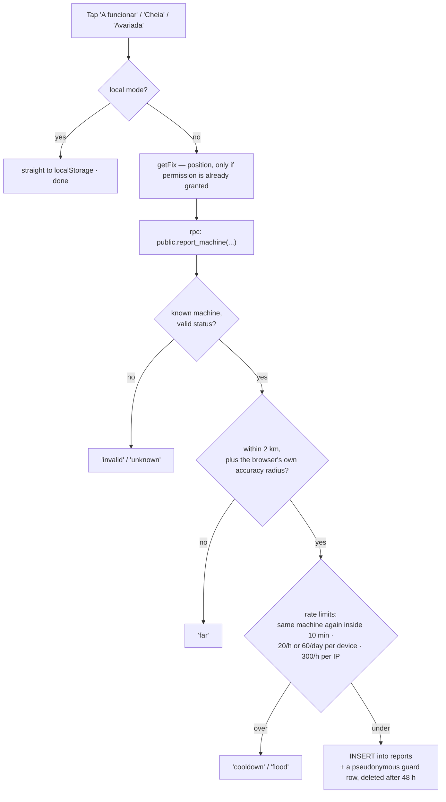
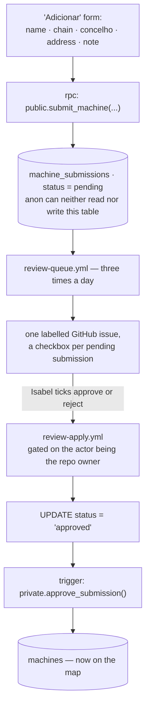
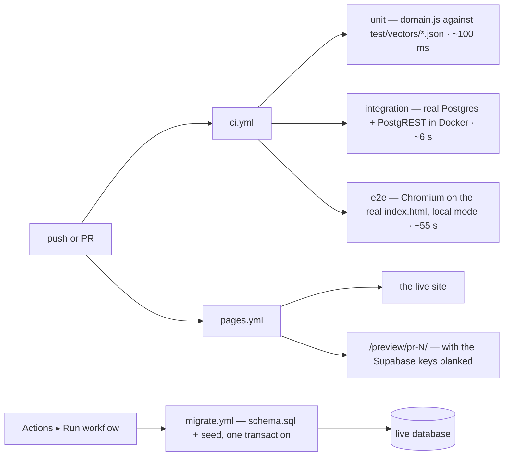

# Diagrams

The same system `docs/architecture.md` describes in prose, drawn. Read that
one for the *why*; this one is for getting the shape of it in your head
quickly. Every diagram is Mermaid, so it renders inline on GitHub — including
the mobile app, which is where this repo is mostly read.

## 1. The whole thing, once

Two things worth noticing. The seed data goes to *both* sides — the same
import feeds the file the browser reads in local mode and the SQL the live
database is loaded from. And the dotted line is a real, supported path: blank
the two config values and the whole app still works, offline, on one device.

## 2. The modules

Every module reads `config.js`; only `domain.js`'s arrow is drawn, because
that is the one that matters — the two decay thresholds. `domain.js` is the
bottom of the graph on purpose: it depends on nothing else, so it can be
lifted out and re-implemented in Swift or Kotlin without dragging the browser
along. See `docs/domain-contract.md`.

## 3. What happens when the page loads

## 4. The decay clock

This is the product, not a detail. A report is only worth something for as
long as it is plausibly still true.

Under 3 h the sheet asks **"Estiveste lá agora?"**. Past 3 h it switches to
**"Ainda está assim?"** — same question, but it now reads as an invitation to
reconfirm. Past 18 h the colour is gone and there is nothing left to confirm.
Both thresholds live in `app/config.js`.

## 5. What a report goes through

Anonymous users have no INSERT anywhere. The only door is one Postgres
function, and it returns a string per outcome so the app can say something
specific in Portuguese instead of surfacing an HTTP code.

No coordinates at all is accepted: blocking a real report is worse than
letting an unverifiable one through, and someone willing to lie picks their
coordinates too. `docs/rate-limiting-plan.md` has the full reasoning.

## 6. What a *new machine* goes through

Anyone can suggest a machine from their sofa — no proximity check, because
people map from home. Nothing they submit reaches the map until it is
approved, and approving is a checkbox in a GitHub issue, not a trip to the
Supabase dashboard.

The scheduled half is the one piece that can fail quietly: GitHub disables
scheduled workflows after 60 days without a commit. `docs/supabase-setup.md`
explains how that shows up.

## 7. What runs in CI, and what ships

CI is the only feedback loop this project has: Isabel works from a phone and
cannot run anything locally, so a red check is the review.
