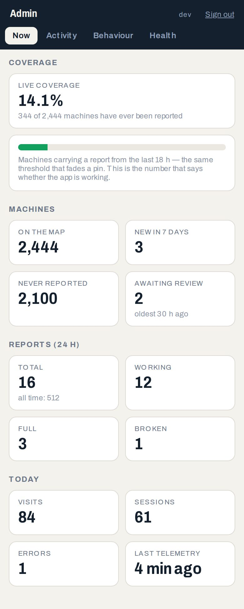
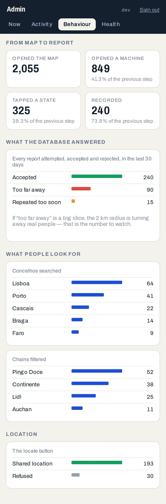
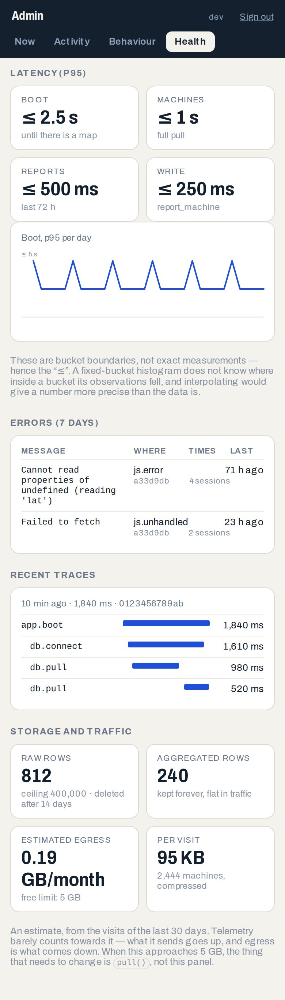

# Observability plan

What the admin dashboard shows, where the numbers come from, what it costs
on Supabase's free tier, and how the login is locked down.

Read `docs/rate-limiting-plan.md` first if you haven't — the telemetry
ingestion reuses its salt, its hashing, and its "return a string, don't
raise" style, because it is the same problem wearing a different hat: an
anonymous endpoint anyone can call, which must not become a way to fill the
database.

## What the dashboard is for

Right now the project is flying blind in three specific ways, and the panel
exists to close them:

1. **Nobody knows how much of the map is actually alive.** The decay
   mechanic is the product. The share of the 2.444 machines carrying a
   report inside `STALE_AFTER` is the one number that says whether the app
   is working, and nothing measures it.
2. **Every rejected report is invisible.** `report_machine()` computes
   `cooldown` / `flood` / `far` / `unknown` / `invalid` and then throws the
   answer away. If the 2 km proximity rule is turning away real people, the
   only evidence today would be someone complaining.
3. **There is no local dev loop.** Isabel works from a phone; CI is
   pass/fail and the live site is a black box. Latency, JS errors and boot
   failures on real phones are unobservable.

## The four screens

Served at `/admin/`, phone-first, one column, same design tokens as the app —
and in English, for the reason set out further down.

### 1. Now
- **Live coverage** — % of machines with a report newer than `STALE_AFTER`.
  The hero number, and the one thing nothing measured before.
- Machines total · added in 7 d · submissions awaiting review, with the age
  of the oldest (the review queue going quiet is a known failure mode — see
  `docs/supabase-setup.md`).
- Reports in 24 h, split working / full / broken.
- Visits, sessions and errors today · when telemetry was last seen.

### 2. Activity
Time series, drawn as inline SVG. No chart library — see "no new
dependencies" below.
- Reports/day by status, 30 d.
- Visits and sessions/day.
- New machines and accepted submissions/day.

### 3. Behaviour
- The funnel: opened the map → opened a machine → tapped a state → the
  write was recorded, each step as a share of the one before it.
- **Report outcomes**, broken out by the strings `report_machine()` returns.
  The "too far away" rate is the most actionable number in the system.
- Search and filter use: top concelhos searched, chains filtered, and locate
  taps with refusals told apart from timeouts.

### 4. Health
- p95 for boot, both pulls, and the write RPC — as bucket bounds ("≤ 1 s"),
  never interpolated into false precision.
- JS errors grouped by message, with count, sessions and release.
- Recent traces as a waterfall: `app.boot` → `db.connect` →
  `db.pull` (machines) → `db.pull` (reports).
- Storage against the ceiling, and the monthly egress estimate below.

## OpenTelemetry, and where the line is drawn

The official OpenTelemetry JS SDK assumes a bundler and costs upwards of
150 KB. That breaks the no-build-step rule outright, and it would land on a
phone that is already paying for Leaflet and a variable font. So the SDK is
out.

What is *in* is the part that actually matters: OpenTelemetry's data model.
`app/telemetry.js` produces real 16-byte trace ids and 8-byte span ids,
parent/child links, semantic-convention attribute names, OTel log severity
numbers, and explicit-bucket histograms. Roughly 4 KB, no dependencies.

The one place this deliberately departs from OTel is the **wire format**.
OTLP/JSON encodes every attribute as `{"key":"x","value":{"stringValue":"y"}}`,
which is three to four times the bytes of a compact envelope and a nested
walk to parse in plpgsql. Uploading that from a phone on mobile data, and
parsing it in a function anyone on the internet can call, are both worse
deals than they look.

So the client posts a compact envelope, the database stores the compact
form, and **OTLP conversion happens at the export edge** —
`private.otlp_export()`, a function that renders any window of stored
telemetry as OTLP/JSON. Nothing about the data model is lost: pointing this
at Grafana Cloud, Honeycomb or a self-hosted Tempo later is a forwarder
reading that function on a schedule, and not one line of the app changes.

## Will it fit on the free tier?

Free tier is 500 MB of database and 5 GB/month of egress. The answer is
yes, comfortably, but only because of *how* the data is stored — a plain
"log every event, delete after 30 days" design does not fit, so it isn't
what this does.

### Two tiers of storage

**`private.telemetry_daily` — aggregates, kept forever.** Counters,
histograms and gauges, upserted in place, keyed by `(day, metric, dims)`.
Most of the twenty-six registered metrics have a handful of dimension values
each — three statuses, eleven chains, six report outcomes. The one that is
legitimately open-ended is `search.town`, and Portugal has 308 concelhos, so
a busy day is a few hundred rows at ~200 bytes: **well under 100 KB/day, and
it does not grow with traffic.** Ten thousand visits a day and a hundred
visits a day write into the same rows.

The hard bound is the per-metric cap of 500 distinct dimension combinations
per day, so even a caller deliberately inventing values cannot take this past
~2,6 MB/day, and cannot get there at all without first getting past the flush
rate limits.

**`private.telemetry_raw` — individual records, 14-day retention.** Only
things that need to be individuals: errors, spans slower than a threshold,
rejected writes, and a small head-sampled slice of traces for the waterfall
on screen 4. Everything else is counted, never stored.

### The arithmetic

A raw row is about 300 bytes with its indexes (16-byte trace id and 8-byte
span id as `bytea`, not 32- and 16-character hex; session as `uuid`, not
text; and the caller's IP hash is **not** on the row at all — it lives in
the rate-limit guard, one row per flush, not per event).

At 2.000 visits/day, ~15 telemetry records per session is 30.000
records/day. Aggregated, that is the same ~40 KB. Head-sampled at 2%, plus
errors and slow spans, the raw tier takes maybe 800 rows/day — **3,4 MB
across the whole 14-day window**. Store all 30.000 raw instead and it would
be 126 MB, which is where the naive design starts eating the tier.

| Visits/day | Aggregated | Raw (14 d) | Total after a year |
|---|---|---|---|
| 100 | ~10 MB/yr | ~0,2 MB | ~10 MB |
| 2.000 | ~25 MB/yr | ~3,4 MB | ~28 MB |
| 20.000 | ~30 MB/yr | ~34 MB | ~64 MB |

Against 500 MB, with `machines` and `reports` taking a few MB between them.
There is room, and there is a ceiling underneath it if the estimate is
wrong.

### Three things that stop it running away anyway

The endpoint is anonymous. Anyone with the anon key — which is public, by
design — can call it, so the estimate above has to hold against someone who
is not a browser.

1. **A metric registry.** `private.telemetry_metric` lists every metric name
   the ingest function will accept, and which dimension keys each may carry.
   Anything else is dropped and counted. This is the load-bearing one: it is
   what stops an attacker inventing unbounded `(metric, dims)` combinations
   and filling the forever-table one row at a time.
2. **Rate limits**, by device and by IP, hashed with the existing
   `private.guard_secret` salt — same scheme as reports and submissions.
   Per flush, not per event.
3. **A hard ceiling.** Above `TELEMETRY_RAW_MAX` estimated rows the raw tier
   stops accepting writes and only aggregates, recording the fact as a
   counter. Pruning is opportunistic (the same `random() < 0.02` trick
   `report_guard` uses) plus a daily sweep.

### The thing that will actually hit the free tier first

Not telemetry — `pull()`. Every visit downloads all 2.444 machines: ~340 KB
of JSON, ~80 KB gzipped, plus 72 hours of reports. At 2.000 visits/day
that is roughly **4,8 GB/month against a 5 GB egress cap**, and telemetry's
uploads do not count toward it (egress is data *out*; the reply to an
ingest call is one word).

This is worth knowing before it happens, so the dashboard estimates monthly
egress from visit counts and pull sizes and shows it on screen 4. The fix,
when it is needed, is a viewport-scoped or delta `pull()` — out of scope
here, but the panel is what will say when.

## The login

"Very secure" for a single-admin panel on a public repo, deploying to a
public URL, means the page itself being public has to be *harmless*. It is,
because the page is not the gate.

**The gate is the database.** Every admin read goes through a
`security definer` function that begins by checking the caller. The
telemetry tables live in `private`, which the Data API does not expose, and
`anon` and `authenticated` have no grants on them in either direction. A
fully authenticated stranger gets nothing; a bug in the dashboard's
JavaScript cannot leak a row that Postgres refused to return.

The policy, in order of how much each part buys:

1. **Sign-ups disabled** in Supabase Auth. With them off, no account can be
   created at all, so the attack surface is Isabel's own account rather than
   "anyone on the internet, plus a mistake in my check". This single setting
   does more than everything below it.
2. **Allowlist by user id, not by email.** Supabase Auth lets a user change
   their own email address. An allowlist keyed on an email is a check that
   can be argued with; one keyed on `sub` (a UUID) cannot. `private.admins`
   holds the uid; the email is stored alongside and checked *against* the
   token, so an email change locks the account out rather than carrying the
   privilege to a new address.
3. **TOTP required, enforced in Postgres.** Supabase Auth issues `aal2` in
   the JWT once a second factor has been verified. `public.is_admin()`
   requires it. So an attacker holding Isabel's password still cannot read a
   row without her authenticator app. This is the difference between "one
   factor that happens to be a password" and actual two-factor.
   It is a column on `private.admins`, not a constant, so if enrolling TOTP
   on the phone turns out to be miserable it can be relaxed with an `update`
   rather than a migration. It defaults to on.
4. **Password, not an emailed code.** This is a change from the first draft
   of this plan, and the reasons only turned up on contact with Supabase.
   The free tier's built-in SMTP is rate limited to a handful of messages an
   hour and is explicitly not meant for production — so a few retries on a
   bad morning could lock Isabel out of her own dashboard, by her own hand.
   And getting a six-digit code rather than a magic link means editing the
   email template to include the token, which is one more thing to do by
   hand on a phone. With TOTP mandatory this is two independent factors
   either way, and the password is the one that cannot fail because an inbox
   was slow. (Magic links have their own phone-specific failure besides:
   tapping the link in a mail app often opens a *different* browser from the
   one holding the PKCE verifier, and the sign-in silently fails.)
5. **An audit trail.** Every successful admin read writes to
   `private.admin_access`: who, when, which function, with what arguments.
   A *refused* one does not — it raises, and the raise rolls its own audit
   row back with it, since Postgres has no autonomous transactions. That gap
   is named in `schema.sql` rather than papered over; it is small, because
   these functions cannot be called at all without a valid session, and with
   sign-ups off there is no third party who could hold one.
6. **No new secret anywhere.** The dashboard uses the public anon key plus
   Isabel's own session. The service key stays out of the repo, as it
   already does.

`is_admin()` reads `request.jwt.claims` directly rather than calling
`auth.jwt()`. Same thing — that is what `auth.jwt()` does — but it means the
function works, and is tested, against the plain Postgres + PostgREST
containers the integration suite already builds, instead of needing a
Supabase-only shim. `test/integration/admin.test.js` mints real signed JWTs
and walks every way in that must not work: no token, a stranger's session,
the right uid at `aal1`, the right uid with a changed email, and a token
signed with the wrong secret.

## The panel is in English

The app is Portuguese and stays that way — it is for people standing in a
supermarket in Portugal. The dashboard is for whoever maintains the thing,
so its copy, its number formatting (`2,444`, `14.1%`) and its tab names are
English. The two are separate audiences and there is no reason to make the
second read the first's language.

Where the two meet, the panel translates: `report_machine()` returns
`far`/`cooldown`/`flood` and the app maps those to its own Portuguese, while
the panel maps the same strings to "Too far away", "Repeated too soon",
"Too many". The database keeps the terse originals.

## What it looks like

| Now | Behaviour | Health |
|---|---|---|
|  |  |  |

Generated by `node tools/screenshots.mjs`, same as the app's, with demo
numbers — the real ones are the live site's and this repo is public. Don't
replace them by hand; re-run the script.

## What Isabel has to do by hand

Kept as short as possible, because every one of these is a tap on a phone
and it is where mistakes have actually happened before.

1. Supabase → Authentication → Providers → Email: **turn off "Allow new
   users to sign up"**. (Supabase moves this between dashboard versions; it
   has also lived under Authentication → Sign In / Providers.)
2. Supabase → Authentication → Users → **Add user**: her email and a
   password. (The panel cannot offer sign-up, by design — see step 1.)
3. Run the **Migrate** workflow. Steps 4 and 5 need `private.admins` to
   exist, and it does not until `schema.sql` has been applied.
4. Open `/admin/`, sign in. It will say the account is not on the admin list
   and print the exact `insert` with her uid already filled in — copy it into
   the SQL editor and run it once.
5. Reload. It will ask her to enrol a second factor: scan the QR with any
   authenticator app and type the six digits back.

Everything else — tables, functions, grants, rollups — is applied by the
Migrate workflow in step 3, as usual.

## Same repo, deliberately

The instrumentation is inside `app/api.js`, `app/main.js`, `app/ui.js` and
`schema.sql`. Split the dashboard out and every telemetry change becomes a
two-repo change, and the rule that a doc is updated in the same commit as
the code that outdates it becomes impossible to keep. It is also the same
Supabase project, the same Migrate workflow, the same CI, and one review
context on a phone instead of two.

The usual reason to split — a backend holding vendor credentials — does not
apply, because there is no backend. Ingestion is a Postgres function, not an
Edge Function, precisely because deploying Edge Functions needs the CLI and
Docker, and Isabel has neither.

`pages.yml` needs `admin/` added to what it copies. Its existing guard —
blank the Supabase values in previews, then refuse to publish if the live
URL or key appears anywhere — already covers the new page, and previews of
the dashboard will simply have nothing to connect to. That is the correct
behaviour.

## Phases

1. **Schema and server-side telemetry.** The two storage tiers, the metric
   registry, `ingest_telemetry()`, the rollup, retention, and recording the
   outcome of every `report_machine()` and `submit_machine()` call.
   *(this commit)*
2. **`app/telemetry.js` and instrumentation.** Spans, logs, metrics, the
   flush path, and the call sites across `app/`.
3. **The dashboard.** `/admin/`, auth, the four screens.

All three have shipped.
